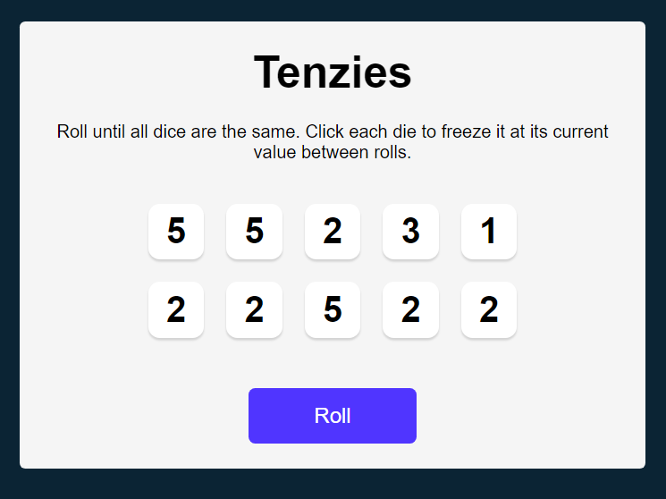

# Tenzies

## **Description:**

### Technologies used:

- React 
- JSX
- JavaScript
- HTML | CSS

### Concepts in the project:

- Web development
- React
- Components web development
- Dynamic website
- Mapping
- Props
- Effect | State

### About this project

This is my react project from scrimba.it replicates the tenzies game using React JS This is A mini game that rolls a dice of ten Keep rolling until all ten of your dice show the same number.